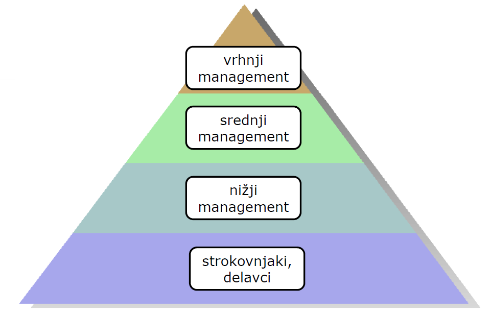

# ORGANIZACIJA DRUŽBE

- Potrošniška družba - cilj je užitek
- Dobrine zadovoljujejo užitke/potrebe
    - Dobrine in potrebe so lahko materialne ali nematerialne
- Delo je glavni način ustvarjanja dobrin
- Za ljudi je pomembno razmerje med ceno in užitkom

## KROŽNI TOK EKONOMSKE DEJAVNOSTI

Dva akterja:
- Gospodinjstva
- Podjetja (in druge združbe)

Dva trga:
- Trg blaga in storitev (neelastičen, ljudje rabijo dobrine, monopoli/oligopoli)
- Trg dela in kapitala (elastičen, podjetja hočejo čim cenejšo delavno silo)

Na trgu blaga in storitev se zapravlja denar za zadovoljevanje naših potreb in želja. Tam gospodinjstva zapravljajo denar v zameno za dobrine. Denar, ki ga tam pustijo, zaslužijo podjetja, ki pa nato na trgu dela in kapitala plačajo uslužbence za opravljeno delo ali narejeno blago.  

Gospodinjstva na trgu dela služijo denar - gre za prodajo svojega časa. Tu podjetja dobijo svoje izdelke, ki jih prodajo na trgu blaga in storitev. Na trgu kapitala se kupuje in ustanavlja podjetja.

Kupec je na trgu blaga in storitev kralj, ker kupuje kar mu prinaša največ užitkov. Na ta način se določa priljubljenost dobrin in obstoj najboljših podjetij. Med podjetji je tako konkurenca glede izdelkov. Denar je merilo vrednosti.

## BRUTO DOMAČI PROIZVOD (BDP)

BDP je merilo za razvitost družbe - prikazuje kako hitro v primerjavi s populacijo raste kup dobrin države.  

### BDP vs BNP

- **Bruto domači proizvod**: vrednost vseh dobrin, pridobljenih znotraj države.
- **Bruto nacionalni proizvod**: vrednost vseh dobrin, pridobljenih s strani državljanov (vključuje tudi podjetja, ki so v lasti državljanov, a se nahajajo izven meja).

BNP < BDP - več državljanov dela za tuje kapitaliste (počasen razvoj)  
BNP > BDP - več tujih državljanov dela za domače kapitaliste (dobro - kapitalisti prinesejo denar domov)

### Pariteta kupne moči (purchasing power parity)

- Mera bogastva, izravnana glede na ekonomski status države (cost of living etc.).

### Pariteta po tečajni valuti (exchange rate parity)

- Mera bogastva posamezne države glede na valuto (koliko užitkov nudi državljanom).

### Izračun BDP

- **Proizvodna metoda**: Glede na prihodke poslovnih sistemov (koliko dohodka so imela podjetja).
- **Izdatkovna metoda**: Glede na izdane račune (trg blaga - koliko denarja se je porabilo).
- **Dohodkovna metoda**: Glede na dohodke dela in kapitala (koliko se je zaslužilo na trgu dela & kapitala).

## VRSTE ZDRUŽB: PODJETJA IN ZAVODI

Zavodi so smiselni za panoge, ki so nujne/v dobrobit državljanov. Privatizacija gasilcev kot primer.

## MONETARNI IN FINANČNI SISTEM

Dobro plačilno sredstvo (denar) olajša menjavo če:  
- postane merilo vrednosti (omogoča ločitev prodaje in
nakupa dobrin)
- ohranja vrednost

### Razvoj monetarnih sistemov:

- Blagovna menjava ( commodity trading )
    - težave z določanjem vrednosti blaga, trajnostjo ...
- Določeno blago kot enota vrednosti ( commodity
money system )
    - kamenčki, težava z inflacijo
    - zlato
- Reprezentativni denar ( Commodity backed money )
    - trgovanje z menicami, ki predstavljajo zlato pri zlatarjih
    - kriza, ko so zlatarji ugotovili, da večina zlata nikoli ne gre od njih in so izdajali več menic kot je bilo zlata (Mayflower primer, "bank run")
    - v Londonu se je vmešala kraljica - vlada hrani zlato
    - težave med industrijsko revolucijo - preveč blaga - deflacija (negativna povratna zveza)
- Fiat denar ( Fiat money )
    - nehalo se je izdajati denar glede na rezerve zlata
    - denar se tiska glede na rast BDPja (stabilnost, vsako leto +1% glede na rast BDP) - v teoriji denar predstavlja BDP
    - delovalo do krize 2011, ko se je začelo tiskati več (da države niso bankrotirale) - posledica je manjša stabilnost

### Primarna emisija denarja

- Primarna emisija denarja je proces izdaje denarja s strani centralne banke preko nakupa vrednostnih papirjev ali dajanja kreditov poslovnim bankam ( Seigniorage - prihodek (presežek) centralne banke od izdajanja bankovcev in obresti ).
- Poslovne banke dajo ponudbe, ki jih centralna banka razvrsti po mamljivosti. Ko se doseže znesek vse plačajo po najnižji ponujeni obrestni meri (da se motivira dajanje ponudb).
- Nato poslovne banke denar investirajo (na borzo, v podjetja, kredite) in po preteku roka vrnejo centralni banki.
- Kredit mora biti kratek, v primeru da BDP pade - huda inflacija, če ne vrnejo.

### Sekundarna emisija denarja

- Sekundarna emisija denarja je proces dajanja kreditov s strani poslovnih bank na osnovi denarja na tekočih računih njihovih strank ( obvezne rezerve, multiplikacija ).

### Pogosti pojmi:
- **Apreciacija** - povečanje vrednosti denarja
- **Depreciacija** - zmanjšanje vrednosti denarja
- **Inflacija** - povečanje cen blaga in storitev
- **Deflacija** - znižanje cen blaga in storitev

## FINANČNE NALOŽBE

### Igre z negativno vsoto
- Povprečen igralec izgubi
- Ven pride manj denarja kot ga igralci vložijo
- Loterija, Kazino, Ponzi shema
- Določeni trgi nepremičnin (odvisno od lokacije, povpraševanja)

*Ponzijeva shema* je oblika goljufije, kjer se vlagatelje zvabi da investirajo v neko "dobrino" in se izplača prejšnjim vlagateljem, ki izstopajo s sredstvi novejših vlagateljev. Računa na pohlep ljudi da bodo držali, ko videjo da raste. V primeru, da začne vrednost "dobrine" padati, goljuf izstopi in ni več denarja. (Bitcoin je igra z negativno vsoto - troši elektriko a ne proizvede ničesar, če bi ljudje izstopili zdaj ne bi bilo možno poplačati).

### Igre z ničelno vsoto
- Ven pride enako denarja kot ga igralci vložijo
- Poker s prijatelji
- Določeni trgi nepremičnin (odvisno od lokacije, povpraševanja)

### Igre s pozitivno vsoto
- Povprečen igralec pridobi
- Investicije
- Skladi
- Določeni trgi nepremičnin (odvisno od lokacije, povpraševanja)
- Včasih tudi banke, hranilnice in zavarovalnice - zdaj že mogoče ne več (negativna vsota)

## FINANČNE ZDRUŽBE

### Banka
- Pretvarja depozite (pasivna obrestna mera) v kredite (aktivna obrestna mera)
    - Ideja je da po višji obrestni meri naprej posoja depoziran denar
- Sodeluje v izdajanju denarja (sekundarna emisija)
- Možnost sprejemanja deviznih vlog (menjava valut)
- Šibke omejitve razpolaganja s pridobljenimi sredstvi (lahko delajo kar hočejo z denarjem)
- Too big to fail, izgube pokrije centralna banka

### Hranilnica
- Pretvarja depozite (pasivna obrestna mera) v kredite (aktivna obrestna mera).
- Omejeno sodelovanje v izdajanju denarja (sekundarna emisija) - ne dobivajo denarja od centralne banke
- Brez dovoljenja za sprejemanje deviznih vlog
- Močne omejitve razpolaganja s pridobljenimi sredstvi (lahko delujejo samo v lokalnem okolju)
- Če hranilnica propade, ne dobiš vloženega denarja nazaj

### Zavarovalnica
- Prevzema stroške nastanka tveganj.
- Pretvarja premije za zavarovanje v zavarovalne vsote, ki krijejo stroške nastalih zavarovanih škod.
- Izravnava tveganja (zavarovanje pred poplavami in sušo - oboje se ne bo zgodilo, tudi ne povsod)
- Porazdeli tveganja (zavaruje določeno tveganje na različnih področjih, zavaruje le del določenega tveganja)
- Zelo dobro področje oligopolov, če vse naenkrat dvignejo ceno ne moreš nič naredit

### Investicijski in naložbeni skladi
- Sklad ne obljublja vračila, temelji na tem, da se z diverzifikacijo investiranja v velika podjetja skoraj ne da izgubiti.
- Vloži se denar, ven se dobi "točke", ki predstavljajo trenutni delež denarja v skladu. Izplača se tako, da se proda ta delež.
- Slabi skladi zaračunavajo stroške upravljanja, tako da se ven dobi manj kot se naredi dobička.
- Povprečna donosnost skladov je 8% pred dodanimi stroški
- **DAX:** top 30 največjih podjetij v paketu
- **ETF skladi** (exchange traded funds): računalnik kupuje DAX, majhne provizije

## ČASOVNA VREDNOST DENARJA

Obrestno obrestni račun (Compound interest formula):  
G - glavnica (P principal)  
o - obrestna mera kot decimalka (i - annual rate of interest as a decimal) - predpostavka da se obrestna mera v obdobju ne spreminja - uporabljamo povprečno obrestno mero obdobja  
n - število let

- Vrednost vsote ob 8% letni rasti in vlaganju eksponentno raste.
- Ljudje se v povprečju težko upremo trenutnim užitkom (marshmallow test), poleg tega pa težko dojamemo eksponentno rast.

## EKONOMSKA GLOBALIZACIJA

V teoriji je bil cilj globalizacije prost pretok kapitala, dobrin in delovne sile (v praksi samo prvi dve - immigrant policies). V tem sistemu naj bi lahko svoje dobrine prodajal kjerkoli po svetu in kupoval ter delal kjer hočem.

Po 2. svetovni vojni je ZDA ustanovila (poleg UN) dve pomembni organizaciji: **WTO - world trade organization** (svetovna trgovinska organizacija) in **IMF - international monetary fund** (mednarodni denarni sklad).  
To so naredili, ker so ugotovili, da vojne vodijo v propad države in so poskusili narediti svetovni red brez vojn, kjer bi bili sami na vrhu. Z globalizacijo lahko lažje osvojiš tuja podjetja in delovno silo.

- WTO zagotavlja, da moraš imeti enake carine za vse države okoli sebe in nobeni ne smeš dvigniti carin. Zaradi tega danes med članicami WTOja praktično ni carin.
- Če ni carin, ima največje koristi država z največjim notranjim trgom, države ki veliko kupujejo od zunaj v tem sistemu propadejo/se zadolžijo
- IMF "pomaga" poravnati dologve zadolženim državam (prodajo podjetja, znižajo plače, etc.). Dokler ne poravnajo dolgov (pristanejo na pogoje IMF) je nad državami tihi embargo - ne morejo kupovati od drugih.

ZDA je računala na ekonomijo obsega (proti malim evropskim državam). Uspešne države so se zato preusmerile v nekaj ključnih panog (Nemčija - avti, Taiwan - IT) in so ZDA uspele pretentati s specializacijo in izdelavo najboljših produktov. (SLO je slaba v tem, se ne specializiramo v nič)  
Prav tako imajo zdaj problem s Kitajsko, ki jih premaguje v njihovi igri z bolj uspešno strategijo obsega.

## NAJVEČJE KRIZE ZADNJIH 100 LET

### Velika depresija 1929-39

- "Roaring Twenties": ogromna rast BDPja zaradi industrijske revolucije
- Deflacija
    - Negativna povratna zveza: vedno nižje cene ker se ne prodaja, ljudje manj kupujejo ker "bodo lahko jutri ceneje kupili", etc.
    - V nekaj mesecih bankrotiralo 70% podjetij ker niso mogli nižati cen
- Wall Street Crash

### Opecov naftni embargo ZDA in zaveznikov 1973-74, 1979

- Arabske države so se zmenile za embargo da umetno dvignejo cene

### Azijska kreditna kriza 1997

## Svetovna finančna kriza 2008

Formalni začetek 15.9.2008 ko je bankrotirala investicijska banka Bear Stearns na Wall Streetu

### Posledice krize v ZDA:
- 6% padec BDP v ZDA v prvih šestih mesecih krize.
- Po enem letu se je stopnja brezposelnosti v ZDA podvojila na 10.1%.
- Cena nepremičnin padla za 30%.
- Vrednost delnic padla za 50%.
- Med 4 in 8 milijonov Američanov izgubilo lastništvo nad svojo nepremičnino. 

### Ključni vzroki:
- Deregulirana nepremičninska posojila (subprime loans in drugi tipi) - 2002
    - Sprememba tipičnih posojil
    - Prvih 5 let ni treba nič odplačati - ogromno novih posojil
    - Banke so predvidevale da bo cca. 20% ljudi po petih letih vrnilo hipoteko
    - Številka je bila 2006 cca. 50%
- Deregulacija Wall Streeta in preoblikovanje nepremičninskih posojil v obveznice (MBS - mortgage backed securities, CDO - collateralized debt obligations) - 2006
    - Te komericalne banke so na Wall Streetu investicijskam bankam ponudile vse obveznice po 80% ceni
    - WS banke so pokupile obveznice, jim dale AAA znamko in jih ponujale naprej tujcem kot varno naložbo
    - Še vedno je bilo "samo za 2000 miljard" slabih obveznic
- Deregulacija zavarovalnic in inovativni finančni "produkti" zavarovalnic AIG in CDS credit default swap)
    - Zavarovalnice so bile zavistne WS bankam, ki so profitirale
    - CDS: papir, ki garantira poplačano originalno vrednost v primeru da vrednost zavarovane dobrine pade pod neko mejo - v tem primeru če hipoteka pade za >20%
    - AIG (American Insurance Group) je prodajal CDSje za majhno premijo
    - Prodanih je bilo za cca. 60.000 miljard CDSjev v enem mesecu

Ker se je izkazalo, da so uprave načrtno delale v škodo vsem za trenuten dobiček so ljudje izgubili zaupanje v banke - propad sistema.

# ORGANIZACIJA IN MANAGEMENT PODJETJA

### Ključne interesne skupine v podjetju:
- Lastniki upravljajo v podjetju (podjetniki)
- Managerji (agenti), ki ravnajo oziroma vodijo podjetje (uresničujejo organizacijske cilje), najamejo pa jih lastniki
- Strokovnjaki in delavci, ki izvajajo strokovne in operativne naloge , vodijo in usklajujejo jih managerji

Nivoji imajo različne interese (konflikti), vrhnji management gleda na svoj dobiček in na obdržanje položaja, srednji management hoče plezat, nižji management prav tako hoče plezat: hoče da delavci čim več delajo in čim manj sprememb (da se lahko dokažejo), delavci hočejo čim manj dela.  
Večina podjetij je v razsulu zaradi konflikta interesov in gledanja le nase - ljudje in nivoji drug drugemu mečejo polena pod noge.

### Ključni pojmi
- **Organizacija** je struktura medsebojnih razmerij med ljudmi, ki zagotavlja smotrno uresničevanje ciljev delovanja združbe
- **Management** (vsebina) je proces planiranja, organiziranja, vodenja (koordiniranja in ukazovanja) in kontrole
- **Management** (rezultati) je proces učinkovitega in uspešnega uresničevanja ciljev s pomočjo drugih ljudi
    - **Učinkovitost** pomeni z minimalnimi stroški ustvariti čim več dobrin
    - **Uspešnost** pomeni ustvariti "prave" dobrine

### Glavne funkcije managementa
- **Planiranje** (dolgoročno in kratkoročno): analiza poslovanja in predvidevanje okolja, določitev vizije, poslanstva in temeljnih ciljev podjetja v določenem trenutku ter določanje poti (strategije) za doseganje ciljev.
- **Organiziranje**: Oblikovanje organizacijske strukture in oblikovanje kulture v podjetju.
- **Vodenje**: koordiniranje, kadrovanje, vodenje, komuniciranje, motiviranje, izobraževanje.
- **Kontroliranje**: Revizija in kontrola delovanja zaposlenih.

Na različnih nivojih se uporablja različne kompetence:

Nižji management predvsem vodi in organizira, srednji vodi, organizira in planira, vrhnji pa organizira in planira.  

Najpomembnejše odgovornosti vrhnjega managementa so:
- postavljanje ciljev
- razvijanje strategij
- določanje ustrezne oblike organizacije 
- prilagajanje organizacije okolju

### Ključne kompetence managerja

- **Konceptualne sposobnosti:** sposobnost managerja da vidi širšo sliko, pride do idej, oblikuje vizijo in plane za njihovo uresničitev
- **Koordinacijske sposobnosti:** sposobnost managerja da koordinira aktivnosti in interese v podjetju
- **Vodstvene sposobnosti:** sposobnost managerja da dela s sodelavci, vidi in razume človeško dimenzijo sodelavcev (čustvena inteligenca), mentorstvo sodelavcem (učenje) in motivacijo sodelavcev
- **Tehnične sposobnosti:** sposobnost managerja da uporablja orodja, postopke in tehnike specializiranih področij
- **Politične sposobnosti:** sposobnost managerja da pridobi sledilce in vzpostavi "prave" veze

# FUNKCIJA PLANIRANJA

- **Planiranje** vključuje določanje ciljev organizacije in definiranje sredstev za njihovo uresničitev
- **Cilj** je želeno stanje v prihodnosti, ki ga želi organizacija doseči
- **Plan** je načrt kako doseči nek cilj in specificira razporeditev t.j. alokacijo resursov, urnik, naloge in druge dejavnosti

### Postavljanje ciljev
**SMART** - Specific, Measurable, Attainable, Realistic, Timely (jasni, izmerljivi, dosegljivi in realistični ter časovno sprejemljivi)

### Hierarhija ciljev
Uprave postavijo veliko ciljev, da lahko rečejo da so jih veliko dosegli. Zato je pomembna hierarhija:

- **Vizija** - opišemo kakšno bo naše podjetje čez 10, 20 let  
- **Poslanstvo** - kako bo podjetje ustvarjalo koristi za vse ključne notranje in - zunanje interesne skupine (zunanja in notranja legitimnost)  
- **Strateški cilji** - na nivoju vrhnjega managementa (veliki cilji, traja dolgo časa)
- **Taktični cilji** - na nivoju srednjega managementa 
- **Operativni cilji** - na nižjih nivojih (day-to-day cilji)

### Zgodovinski razvoj oblikovanja strategij
- načrtovanje računovodskih predračunov (budgeting - letno)
- dolgoročno načrtovanje dejavnikov podjetja na osnovi zgodovinskih podatkov (večletni načrti)
- vključitev zunanjih dejavnikov okolja 
- strateško načrtovanje s stalno kontrolo in analizo dolgoročne usklajenosti pomembnih dejavnikov

## Oblikovanje strategije
### 1. Analiza okolja
**SWOT analiza**

### 2. Določitev ciljev/strategij
- **Strategija** je pot kako priti do željenih ciljev, ponavadi zapisana v strateškem planu/načrtu.
- **Nivo podjetja** (Corporate strategy): Določitev panog v katerih naj v prihodnje
poslujemo (What business should we be in?)
- **Nivo strateške poslovne enote** (Business strategy) Kakšna bo naša konkurenčna prednost v tej panogi? (How shall we compete in this business?)

### 2.1. BCG matrika

### 2.2. Porterjeve strategije strateške poslovne enote
- **Stroškovna strategija** (Cost leadership)
- **Strategija diferenciacije** (Diferentiation)
- **Strategija fokusa** na določen tržni segment (Focus on a particular segment)

### 3. Izvedba strategije s pomočjo:
- **Vodenja** - prepričevanje, motivacija (tudi manipulacija) ljudi
- **Organizacijske strukture** - oblikujemo oddelke in uredimo način izvedbe dela
- **Informacijskih sistemov** - za nadzor
- **Ravnanja z ljudmi pri delu** - glede na potrebe strategije se zaposluje, odpušča, napreduje

### 4. Ocena in kontrola strategije - Demingov PDSA model

# FUNKCIJA ORGANIZIRANJA

**Organizacijska struktura** je orodje managementa za doseganje ciljev podjetja. Določa združevenje posameznikov v oddelke, in oddelke v celotno organizacijo.

## 1. KLASIČNA ŠOLA

- Klasična šola smatra organizacijo za **instrument za dosego cilja**. *"Dobra organizacija je kot dobro naoljen stroj."*  
- Za zgled so vzeli organizacijo Pruske vojske.
- **Glavna enota analize je delavec, ki ga je treba izmeriti in optimizirati.**
- **Posamezniki naj samo delajo svoje delo, naj ne razmišljajo** (če ne ubogaš boš kaznovan).
- **Poudarja racionalnost** (le na vrhu se lahko dela odločitve, ker imajo samo oni dovolj informacij, vidijo "big picture")
- Ključna vrednote so **ubogljivost, red, poslušnost** - važno samo koliko se naredi.

### Kritika klasične šole
- Klasični pogled na organizacijo je pogled na organizacijo brez ljudi (Scott, 1987)
- Klasična šola obravnava organizacijo kot zaprt sistem brez zunanjih vplivov
- Ljudi se obravnava kot stroje, kar pa niso
- Študije tovarne Hawthorne

### Hawthorne
- Tovarna elektronike v ZDA
- Analize in eksperimenti med leti 1924-1932 o optimizaciji dela
- Pomembna raziskava o vplivu jakosti svetlobe na učinkovitost delavcev
    - Pričakovali so neko logično funkcijo odvisnosti
    - Razdelili tovarno na kontrolno in testno polovico
    - Ne glede na osvetljenost je produktivnost neverjetno rasla vsak teden
    - Delavke so se samoorganizirale in optimizirale ter uskladile produkcijo ker so mislile, da jih bodo polovico odpustili
- Ugotovili, da človek ni stroj in da nekdo ki se ukvarja z določenim delom bo vedno vedel več od uprave o tem delu
- Motivacija največji faktor pri učinkovitosti dela

Klasično strukturo se še vedno uporablja v tovarnah etc., kjer se nove delavce lahko hitro pridobi in kvaliteta dela ni pomembna.

## 2. HUMANISTIČNA ŠOLA

- Nasprotje klasične šole.
- Učinkovitost in uspešnost organizacije odvisna od ljudi in kulture podjetja.
- Na podlagi raziskav dve ugotovitvi:
    - Pogosto obstajajo velike razlike med uradnimi cilji in dejanskimi cilji.
    - Uradno določeni cilji niso edini cilji, ki vplivajo na obnašanje družbe (preživetje kot eden izmed ključno prisotnih).
- Predstavlja organizacijo kot **organsko socialno strukturo**.
- **Glavna enota analize je njen član, njegovo obanšanje, zadovoljstvo in motivacija** (obravnava se jih kot ljudi in se osredotoča nanje)
- **Organizacija mora upoštevati posameznikove cilje in se jim prilagajati.** (agilne skupine, kjer si vsak določi delo)
- **Racionalnost je omejena** (nihče nima res vseh informacij, jasne cilje in dolgoročne strategije je težko določiti, zato je potrebno oblikovati organizacijo s plosko hierarhijo in ohlapno delitvijo dela ter ekipno komunikacijo)
- Ključna vrednote so **spoštovanje članov, prilagajanje članom, dobro vzdušje, zadovoljstvo**

### Kritika humanistične šole
- Tudi ta obravnava organizacijo kot zaprt sistem brez zunanjih vplivov
- Ozirajo se le na notranje potrebe, ne pa na spremembe v okolju - ni se treba prilagajati, lahko imamo eno poenostavljeno organizacijsko strukturo
    - Pravi, da je univerzalna rešitev

## 3. ŠOLA SISTEMSKEGA POGLEDA

- Upoštevanje okolja (za razliko od drugih dveh).
- Prepoznava, da je organizacija sestavljena iz podsistemov - ključno je, da so podsistemi skladni drug z drugim in z okoljem.
- Predstavlja organizacijo kot **odprt sistem, ki se neprestano uči, izboljšuje in prilagaja okolju**.
- **Glavna enota analize je sama organizacija in njeni ključni podsistemi- procesi, ki ustvarjajo dodano vrednost.**
- **Odnos posameznik-organizacija je med mehansko in organsko organizacijo tako da je najbolj skladen s potrebami zunanjega in notranjega okolja.** (se prilagaja case-by-case na daljici med enim in drugim robom)
- **Racionalnost je omejena** (prepozna, da vrhnji management ni vsemogočen, a pravi da ima nalogo neprestanega učenja in izboljševanja na podlagi sprememb okolja)
- Ključna vrednote so **prilagodljivost spremembam okolja, neprestano učenje in neprestane izboljšave**

## ORGANIZACIJSKE STRUKTURE

### Funkcijska (klasična) organizacijska struktura

- cca. 80% podjetij oblikovanih na tak način
- podjetje razdeljeno na funkcijska področja, kjer vsak oddelek vodi najbolj sposobna oseba na področju
- dokaj mehanska struktura, nekje vmes

**Prednosti:**
- Ker zaposleni iz iste stroke delajo skupaj, to olajša določanje obsega dela in kvaliteto dela ker vsi (tudi manager) razumejo delo
- Zaposleni v istem oddelku govorijo "isti jezik" (lažje učenje, komunikacija)

**Slabosti:**
- Oddelki se ne marajo med sabo ker vsi tekmujejo za omejen funding
- Za vse večje odločitve mora poskrbeti vrhnji management ker imajo edini nadzor nad več oddelki (oddelki lahko "porinejo" odločitve navzgor in vrh preveč obremenijo)

### Divizijska organizacijska struktura

- originalno ideja ameriške vojske, ker je bila organizacija prevelika za vrhnji mangement
- med oddelke in vrhnji management se vrine še en nivo divizij
- dokaj mehanska struktura, nekje vmes

**Prednosti:**
- Posamezne divizije se ukvarjajo le s posamezno produktno skupino, kar vodi do:
    - Globjega razumevanje kupcev
    - Dobro koordinacijo znotraj divizije

**Slabosti:**
- Otežena koordinacija med divizijami (divizije so zaključene celote, tekmujejo med sabo)
- Poddvajanje oddelkov in znanj med divizijami

### Projektna organizacijska struktura  
  

- funkcijska organizacija, kjer se projekte koordinira med oddelki s projekti
- poskus odpravljanja nekomunikacije med oddelki
- dokaj mehanska struktura, nekje vmes

**Prednosti:**
- Močno poistovetenje s ciljem projekta
- Visoka koordinacija med oddelki
- Zaposleni imajo celovitejši pogled nad poslovanjem, možnost pridobivanja znanj iz drugih strok
- Več decentraliziranega odločanja

**Slabosti:**
- Otežena koordinacija med projektnimi ekipami
- Izolacija ekspertov v posamezne projektne skupine (ne spoštuje se strokovnjaka ker se področja ne razume)
- Podvajanje del znotraj projektnih ekip
- Osredotočenost na projekt (spregledanje priložnosti)

### Matrična organizacijska struktura  
  

- Primerna za zelo velika podjetja, ki ne želijo izolacije divizij
- Dvojno vodenje: šef oddelka in šef projekta (zabrisane meje med oddelki)
- Se redko obnese ker ima večina kultur močno hierarhijo
- Precej organska struktura

**Prednosti:**
- Hkraten fokus na zahteve zunanjega in notranjega okolja (tehnologija in produkt)
- Znanje je vedno na voljo
- Zaposleni se zavedajo potrebe po celostnem pogledu/skladnosti med zunanjim in notranjim okoljem

**Slabosti:**
- Zmedenost kupcev (h komu jih napotimo za neko stvar)
- Potrebuje ogromno komunikacije in koordinacije
- Porazdeljena odgovornost (nejasno kdo je kriv)
- Otežena identifikacija organizacijskih težav

### Procesna organizacijska struktura  
  

- Mehanska struktura
- Ena ekipa servisira en produkt od začetka do konca (agile)

**Prednosti:**
- Jasno določeni cilji, vsak ve kaj dela znotraj procesa (cilj je uspešen produkt)
- Hitra in sistematična zaznava in odprava problemov znotraj procesa
- Omogoča skupen pogled (vizijo) strokovnjakov iz različnih funkcij

**Slabosti:**
- Mnenja posameznih ekspertov se lahko zaradi poudarka na celotnem procesu razvrednoti in ignorira
- Podvajanje dela znotraj posameznih procesov (vsak dela svoje, ostalo me ne zanima)
- Proces lahko postane pomembnejši od kupcev

### Mrežna (virtualna) organizacijska struktura  
  

- Ideja je da ni vnaprej določene strukture
- Preko interneta se omogoči vsem komunikacijo
- Struktura se bo že sama izoblikovala
- Najbolj organska struktura

**Prednosti:**
- Koncept ideokracije - ker imajo vsi enakovreden glas, naj zmaga najboljša ideja
- Velika svoboda zaposlenih v izbiri znanj, fleksibilnost
- Večje zadovoljstvo zaposlenih zaradi fleksibilnosti (delo od doma)

**Slabosti:**
- Težave s samodisciplino
- Tveganje da pride do kaosa v delovnem okolju (nove ideje, debate, nestrinjanje)
- Zaradi svobode pri vključevanju v ekipe je težko določiti vloge in vzpostaviti pravila delovanja

### Organska vs Mehanska struktura

Mehanska (vertikalna) organizacijska struktura:
- stroga hierarhija
- specializacija
- centralizirano odločanje
- vertikalna komunikacija in nadzor
- prevladuje individualno delo
- poudarek na učinkovitosti

Organska (horizontalna) organizacijska struktura:
- ploska hierarhija
- širše opredeljene delovne naloge
- decentralizirano odločanje
- horizontalna komunikacija in nadzor
- prevladuje timsko delo
- poudarek na učenju (učeča se organizacija)

**Situacijska (kontingenčna) teorija:** Nobena organizacijska struktura ni univerzalno najboljša, ampak je primernost določene strukture odvisna od več faktorjev:
- velikosti podjetja
- strategije (stroški = mehanska, diferenciacija rabi dobre ideje = organska)
- tehnologije (serijska, zvezna = mehanska, unikatna = organska, vezana na znanje)
- dobaviteljev in distributerjev (manj pogajalne moči kot imaš, bolj je treba gledati na stroške)
- kupcev (bolj zahtevni kupci = boljše ideje = bolj organska)
- konkurence (hujša konkurenca = manj si lahko privoščiš)
- zaposlenih (sindikati, več kot jih je, bolj je treba spoštovati delavce)
- institucionalnega okolja (interesne skupine, politične stranke, ...)

Primeri:
- gradbišče: funkcijska - ni smiselno zgradbe enotno graditi ampak postopoma (naredijo gradbinci, naredijo vodovodarji), delo je določeno - samo naredi
- proizvodnja bele tehnike: divizijska - zahteva različna znanja, velik proces, delavci niso pomembni kot individualci
- farmacevtsko podjetje: mehka divizijska/matrična - potreben ekipen RnD 
- oglaševalska agencija: matrična - dosti potrebnih znanj, majhno podjetje, lahko tudi projektna, mrežna ponavadi ne zaradi cene
- razvoj programske opreme: ponavadi procesna ali pa divizijska za gigante

# FUNKCIJA VODENJA
Vodenje je sposobnost angažiranja drugih za dosego skupnih (ali pa lastnih) ciljev.

## 1. Lastnosti velikih mož (1800-1940)

### Demografske lastnosti:
Spol, velikost, teža, fizična moč, izgled, energičnost, zdravje, inteligenca, način govora, vztrajnost, samozavest, etičnost…
Te vplivajo na kratki rok - pritegnejo ljudi.

### Kompetence in sposobnosti (kako vodja pristopa k izvajanju nalog/doseganju ciljev):
Izkušenost, znanje, izobrazba, prilagodljivost, originalnost, kakovost odločanja…
Če imajo ljudje nekoga za "slabšega" od njih mu ne bodo sledili - pomembno na dolgi rok.

### Medsebojne lastnosti (kako se vodja obnaša do drugih):
Ekstrovertnost, dominantnost, duhovitost, sposobnost poslušanja, popularnost, družabnost, diplomatskost, pripravljenost na sodelovanje…
Dosti teh lastnosti ne pomaga veliko, so mislili da.

### Matrika maršala Moltke za kategorizacijo častnikov:

Raziskave so pokazale, da sta dimenziji komptence in energetičnosti pomembne ker ustvarita **legitimnost vodje** v očeh podrejenega in bo takšne ljudi pripravljen spoštovati/ubogati.  
Poleg tega je zelo pomembno še **kompetentnost, lojalnost vrednotam skupine in poosebljanje vrednot skupine**. (Primer Revoz in francoski upravitelji - pivska kultura, Trumpova retorika)

## 2. Ključna obnašanja vodij (1940-1960)

Noben ekstrem ni dober, ključno je ravnotežje. Problem slovenskih politikov je da padejo preveč v eno skrajnost.

### Skrb za ljudi
Odkrita komunikacija, zaupanje v vodjo, spoštovanje, participativnost, vzdušje (medosebni odnosi)

### Skrb za rezultate
Organizacija, poudarek na doseganju rezultatov, opredelitev struktur, nadzor

### Model managerske mreže

Treba je stremeti k "Team management". Ostale vrste managerjev je treba naučiti da grejo v smer, kjer jim ne gre dobro.  
V primeru managerjev, ki ne skrbijo za ljudi jim bodo podrejeni zamerili in ne bodo hoteli delati, v primeru managerjev, ki ne skrbijo za rezultate jih podrejeni ne bodo spoštovali.

## 3. Situacijski pristopi k vodenju (1960-1980)

**Stogdill** je trdil, da ni univerzalnih lastnostih dobrega vodje, pravi splet lastnosti se spreminja s situacijo, v kateri se vodja nahaja.

### Fiedlerjev model vodenja
**Fiedler** je nadgradil model managerske mreže (skrb za ljudi, skrb za rezultate) s tremi situacijskimi faktorji:
1. Odnos med vodjem in sledilci (dober slab)
2. Strukturiranost nalog (visoka nizka)
3. Moč vodje (visoka nizka)

### Hersey in Blanchardov model

Vodja mora prilagoditi svoje obnašanje glede na motiviranost in kompetentnost sodelavcev (4 stili vodenja):
- **Ukazovanje:** ko podrejeni ne znajo in nočejo - dajanje navodil
- **Mentorstvo:** ko podrejeni ne znajo, a hočejo - razlaganje
- **Sodelovanje:** ko podrejeni znajo, a nočejo - izmenjevanje idej (ljudje podzavestno matchajo effort v ekipi)
- **Delegiranje:** ko podrejeni znajo in hočejo - prepuščanje odločitev (LeBron)

Pomembna je sposobnost razpoznavanja situacije in pravilne izbire načina vodenja.

## 4. Odnos vodja - sledilec (1980+)

Pravijo vodenje ni stvar lastnosti in obnašanje vodij, niti situacij v katerih se znajdejo, temveč je stvar odnosa vodja sledilec. Pomembno je kako so
sledilci motivirani - če ti uspe vzpostaviti "trop" bodo sledilci sami potegnili nove ljudi. Prav tako jim trop postane vedno bolj pomemben (lahko delajo zastonj, lahko je izločitev kazen)

**Transakcijski vodja:** Njegov odnos do sodelavcev temelji na izmenjavi medsebojnih koristi. Medsebojni odnos ne gre globlje kot od pogajanj v katerih se določi kdo kaj da opredeli tip in velikost osebnega interesa.

**Transformacijski vodja:** Njegov odnos do sodelavcev ima nanje tako močan vpliv da postavijo interese kolektiva pred osebne interese.

*Kako postati transformacijski vodja?*  
Fokus na razumevanje kaj motivira sledilce - fokus na preučevanje **teorij motivacije**:
- **Vsebinske motivacijske teorije** - kaj motivira obnašanje
- **Procesne motivacijske teorije** - kako motivirati obnašanje

## VSEBINSKE MOTIVACIJSKE TEORIJE

### Motivacijska teorija Maslowa (1943)

Piramida hierarhij potreb. Pravilno je identificiral karere potrebe imamo, a je naredil napako glede razporeditve, ker potrebe zelo nihajo glede na posameznika (osnoval jih je na poskusih z živalmi).

### Herzbergova dvofaktorska teorija (1959, 1966)

Ker na zadovoljstvo in motivacijo pri delu vplivajo drugi dejavniki kot pa na nezadovoljstvo pri delu je potrebno razlikovati med **motivatorji** in **higieniki:**

- **Motivatorji:** dejavniki zadovoljstva pri delu in pozitivnih občutkov glede dela v povezavi s samo vsebino dela 
    - Primeri: zanimivo delo, delo je izziv, odgovornost, priznanje za dobre rezultate, vključenost v odločanje, možnost napredovanje, pomen dela za institucijo
    - Ti predstavljajo motivacijo
- **Higieniki:** dejavniki nezadovoljstva pri delu, ki označujejo kontekst, v katerem se delo opravlja 
    - Primeri: varnost službe, višina plače, dodatne ugodnosti, pogoji dela, dopust…
    - Če se doseže enega od teh, ta potem ne predstavlja več motivacije vnaprej, le nezadovoljstvo če se izgubi

4 možne kombinacije:
- M+H+: visoko motivirani zaposleni z malo pritožbami
- M+H-: visoko motivirani z veliko pritožbami (čas!)
- M-H+: ni pritožb, ni motivacije (pride po plačo)
- M-H-: veliko pritožb, brez motivacije

### McClellandova motivacijska teorija treh potreb (1960, 1977)

Ljudje imajo:
- Potrebo po dosežkih/rezultatih
- Potrebo po pripadnosti
- Potrebo po moči
 
Ključno je ugotoviti kakšne potrebe ima podrejeni in te potrebe zadovoljiti (izgradnja psihološkega profila - intervjuji, način kako nekdo opiše dogodek/situacijo)

- **Potreba po dosežkih**
    - "Perfekcionisti"
    - Velika mera samozaupanja
    - Treba dati izziv/nagrade
    - Radi delajo v okviru zmernih tveganj, ko je delo že izziv, ni pa rezultat dela še zelo tvegan. Visokih tveganj ne marajo, saj so mnenja da so ob visokem tveganju rezultati stvar naključja in ne njihovega dela.
    - Želijo dobiti konkretno povratno informacijo glede rezultatov njihovega dela.
    - Hočejo poštene in uravnotežene kritike: kaj so naredili dobro, kaj slabo
- **Potreba po pripadnosti**
    - "Klepetulje"
    - Usmerjeni predvsem k snovanju in vzdrževanju dobrih odnosov z ljudmi
    - Treba dati svoj čas, kaznuje se z ignoriranjem
    - Želijo biti priljubljeni med ljudmi in želijo, da se tudi drugi med seboj dobro razumejo in uspešno rešujejo konfliktne situacije.
    - Oseba s takšnimi potrebami se najbolje znajde v skupinskem delu
    - Ne marajo tveganja, ne podpirajo sprememb ustaljenih vrednot v združbi zaradi strahu pred zavrnitvijo
    - Dobri kandidati za začetek dela v skupini/začetek tropa
    - Hočejo "mehko" kritiko: nočejo izstopati, v privat + najprej jih pohvališ
- **Potreba po moči**
    - "Control Freaks"
    - Želja uveljavljanja tako čustvene kot vedenjske kontrole in/ali vpliva nad ostalimi
    - Željo po ugledu, simbolih moči in nadzoru
    - Uživajo v delu in močno cenijo disciplino (kontrola nad sabo)
    - Uživajo v izboljševanju statusa, ko obvelja njihova, v tekmovanju, osebnem prestižu
    - Hočejo direktno kritiko.

## PROCESNE MOTIVACIJSKE TEORIJE

### Teorija enakosti (Adams, 1965)

Motivacija in zadovoljstvo zaposlenega sta odvisna od njegovega prepričanja, da je v primerjavi z njegovo referenčno skupino (drugimi zaposlenimi) enakopravno obravnavan.  
Razmerje med prejemki in vloženim delom za pridobitev le-teh mora biti zanj in njegovo referenčno skupino enako - **ljudje neprestano ocenjujejo delo sodelavcev in se prilagajajo na opaženo povprečno količino dela.**

Obstajajo 3 skupine ljudi:
- **Dobrodelni:** pripravljeni narediti več kot ostali, jih ne moti če ostali manj naredijo (idelaen delavec)
- **Občutljivi:** nehajo delati, če opazijo da nekdo manj dela, "ker ni fer"
- **Zaverovani vase:** prepričani, da njim ni treba delati enako kot ostalim - najbolj problematični (ne morejo obstajati poleg občutljivih)

### Teorija pričakovanja (Vroom, 1964)

Razlaga faktorje, ki vplivajo na motivacijo posameznika:

- **Pričakovanje:** kako posameznik določa koliko truda mora vložiti za doseg cilja (ali lahko z določenim trudom doseže cilj)
    - odvisno od samoocen lastne sposobnosti, težavnosti dosega cilja in kontrole nad uresničevanjem cilja
- **Instrumentalnost:** prepričanje posameznika, da bo dobil nagrado za doseg cilja.
    - odvisno od zaupanja nadrejenim in pravil nagrajevalnega sistema
- **Valenca:** koliko posamezniku pomeni nagrada.

# FUNKCIJA KONTROLE

**Kontroliranje** je zbiranje in poročanje informacij o uspešnosti in učinkovitosti delovanja organizacije. Uporablja se za pregled nad skladnostjo delovanja z zastavljenimi cilji.

**Procesi kontroliranja:**
- Določanje standardov/pričakovanih rezultatov (pogosto del planiranja)
- Spremljanje dejanskih rezultatov
- Primerjava dejanskih rezultatov s pričakovanimi
- Analiza odklonov
- Izvedba korektivnih ukrepov

**Dve dimenziji kontrole:**
- **čas kontrole**: pred procesom, med procesom, po procesu
- **vrsta kontrole:** kontrola obnašanja, kontrola rezultatov

## Tipi kontrol

### Vnaprejšnja kontrola
- Poizkuša prepoznati in preprečiti odstopanja še preden pride do njih.
- Namen je z visoko kvaliteto inputov vnaprej preprečiti probleme.

### Sprotna kontrola
- Nadzira tekoče aktivnosti zaposlenih, da bi zagotovili njihovo usklajenost s standardi (išče se odstopanja od ciljev).
- Namen je zagotovitev, da bodo tekoča dejanja dala želene rezultate.

### Povratna kontrola
- Osredotoča se na kvaliteto končnega proizvoda ali storitve organizacije.
- Namen je zagotoviti da so nagrajena obnašanja zaposlenih in dobri rezultati dela (in obratno za slabe). 
- Se uporablja za učenje za vnaprej.

### Kontrola obnašanja
- Nadzira proces.
- Primernejša v dinamičnem okolju (ko se težko oceni rezultate zaradi spremninjajočih se zunanjih dejavnikov).

### Kontrola rezultatov
- Primernejša v statičnem okolju.

## Moderni trendi izvajanja kontrole

### Vertikalna kontrola

- centralizirana (birokratska)
- 1:n - ne deluje več, se ne da nadzirati veliko ljudi
- omejuje informacije
- primer en nadzornik v hali programerjev (alt-tab zabava)

### Horizontalna kontrola

- decentralizirana (samokontrola)
- deli informacije in pooblašča zaposlene
- se osredotoča na (horizontalno) kontrolo med skupinami enakih
- primer Stalin in NKGB (vsak pove 2 imeni na mesec)
- primer Google (povej 2 naj sodelavca - inverse Stalin)
- napor kontrole outsourcan delavcem (deli in vladaj)
